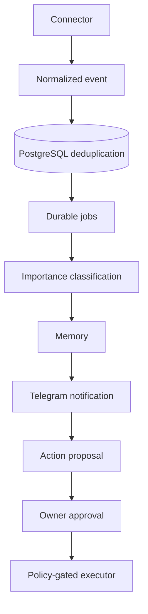

# Innie AI

**Innie AI** is a personal AI assistant built on the [Claude Agent SDK](https://platform.claude.com/docs/en/agent-sdk/overview). It runs on a dedicated MacBook as the single primary worker, with an optional cloud VPS for private monitoring and encrypted off-site backups. Its job is to watch the owner's permitted Gmail, WhatsApp, iMessage and LinkedIn sources, prioritize what matters, notify the owner on Telegram, draft contextual replies, discover and rank job opportunities, tailor CVs from verified facts only, and prepare responses and applications that leave the system only after the owner explicitly approves them.

> **Status:** specification and implementation handoff. No application code, infrastructure or deployment exists yet. See [Project status](#project-status).

**Contents:** [Inspiration](#inspiration-severance) · [What it does](#what-it-does) · [Architecture](#architecture) · [Autonomy and security](#autonomy-and-security) · [Implementation order](#implementation-order) · [Getting started](#getting-started) · [Documentation map](#documentation-map) · [Project status](#project-status)

## Inspiration: Severance

Innie AI is inspired by the Apple TV+ series *Severance*. On Lumon's severed floor, an employee's "innie" is the work self who exists only at work, while the "outie" lives the rest of life. Innie AI borrows the idea:

- **The innie is the agent.** It does the job-search, career and communication work (reading, triage, drafting, matching) on its own dedicated machine and inside a bounded world: isolated connectors, bounded context, and no shell or browser tools for the analysis agent.
- **The outie is the owner, who keeps control.** Nothing leaves the system without the owner's explicit approval of the exact content and destination. That covers every email, message, post, comment and application.
- **Unlike the show, the outie is never kept in the dark.** Every action is audited, and proposals reach the owner through Telegram for a decision.

Innie AI is an independent personal project. It is not affiliated with or endorsed by Apple.

## What it does

Every capability below is **planned**; none is implemented yet. Phase labels (P0–P7) refer to [Implementation order](#implementation-order).

### Inbox triage: Gmail → Claude → Telegram (P1)
- Polls Gmail read-only (`gmail.readonly` scope) about every 180 seconds, with the initial backfill limited to the last 7 days. It deduplicates messages, never marks mail as read and does not ingest attachments.
- Analyzes each new email with the Claude Agent SDK into a validated structured result:
  - priority (`urgent`, `high`, `normal` or `low`)
  - category, summary and reasons
  - an optional suggested reply
  - a human-review flag
- Notifies the owner through a Telegram bot that answers only the allowlisted owner. Commands: `/status`, `/digest`, `/pending`, `/approve`, `/reject`, `/pause`, `/resume`.
- Proposes reply drafts. Sending stays disabled until it is separately enabled (P7).

### Career Intelligence Agent (P2)
- Keeps a versioned professional profile that the owner confirms: verified roles, technologies and achievements, locations, work authorization, languages, target titles, compensation and remote/hybrid preferences. The initial title candidates are Staff Backend Engineer, Principal Engineer, Backend Tech Lead and Solution Architect.
- Discovers vacancies from LinkedIn job-alert emails, permitted job-board feeds and APIs, and employer career pages. It deduplicates by employer, role, location and job ID, and keeps the original posting URL, posting date, requirements and published compensation.
- Scores each match on a configurable, explainable 0–100 rubric: seniority 25, technical/domain fit 25, location/remote 20, responsibilities 15, compensation 10, other 5. Hard exclusions override the score.
- Generates job-specific CV variants (PDF/DOCX), cover letters and drafts of answers to application questions. Every variant starts from an immutable master CV and uses verified achievements only, so the agent never invents experience.
- Tracks each application through these stages: discovered → shortlisted → prepared → awaiting approval → submitted → follow-up → closed. If there is no authorized way to submit directly, it produces a manual submission packet.

### LinkedIn (P3)
- Tracks relevant professional posts and recruiter opportunities through permitted feeds, alerts and job-alert emails.
- Summarizes why each one matters and drafts professional comments or replies, then asks for approval before anything is posted.
- Excluded: feed scraping, assumed access to private messages, Easy Apply automation, mass messaging, automated commenting and automated applications.

### iMessage and WhatsApp (P4, P5)
- Research comes first, and nothing is built until the owner consents.
  - **iMessage:** research macOS Automation and user-granted permissions, and build a prototype only with the owner's permission.
  - **WhatsApp:** distinguish personal WhatsApp, which has no general official API for existing chats, from the WhatsApp Business Platform. No unofficial session extraction, browser bypass or reverse-engineered API.
- If a capability is unsupported, its connector ships disabled with an honest status. A documented, tested, disabled connector counts as an acceptable outcome.

### Shared memory, digests and reliability (P6)
- Cross-channel memory holds verified profile facts (kept apart from inferences), contacts, relationship context, job and application history, source links and confidence, with retention, deletion and export. Personal-message bodies are not kept permanently by default.
- Adds a daily digest, quiet hours, importance rules and configurable VIP contacts.
- Takes encrypted off-site PostgreSQL backups with restore drills into a scratch database. An optional VPS only monitors the MacBook.

### Connector feasibility

From [docs/CONNECTORS.md](docs/CONNECTORS.md):

| Source | Read / monitor | Write | v1/v2 strategy |
|---|---|---|---|
| Gmail | Official Gmail API | Draft/send with scopes | v1 read-only; sending later with approval |
| Telegram | Bot API | Notify owner | v1 long polling and owner allowlist |
| WhatsApp personal | No general official API to read all personal chats | Unsupported by default | Research; no unauthorized automation |
| WhatsApp Business | Official Cloud API with business constraints | Business messaging | Optional separate number, consent and approval |
| iMessage | No general public full personal-chat API | macOS-specific feasibility | Prototype only after owner permission |
| LinkedIn personal | Limited authorized APIs, alerts | Restricted | Email alerts and permitted sources; approval for actions |
| Job boards | Authorized APIs, RSS, alerts, employer sites | Provider-dependent | Career agent |

## Architecture

All components are planned. The event pipeline from [docs/MULTICHANNEL_ARCHITECTURE.md](docs/MULTICHANNEL_ARCHITECTURE.md) looks like this:



For the detailed v1 Gmail data flow, see the diagram in [docs/IMPLEMENTATION_SPEC.md §2](docs/IMPLEMENTATION_SPEC.md#2-architecture).

### Components

| Component | Role |
|---|---|
| Connectors | Gmail and Telegram first; LinkedIn and job sources, iMessage and WhatsApp later. Each connector implements one shared interface: it declares its capabilities (`read`, `notify`, `draft`, `send`, `publish`, `apply`), reports health, polls with a cursor, and prepares or executes approved actions. Events are unique per `(source, externalId)`, with UTC timestamps and source provenance. |
| PostgreSQL 17 | Stores messages, the durable job queue, analyses, approval requests, action executions, audit events, memory items and system state. It stays private, with no public port. |
| Durable job worker | Atomic leases (`FOR UPDATE SKIP LOCKED`) with heartbeat, safe recovery after a crash, at most 5 attempts, exponential backoff with jitter, and a dead-letter state. |
| Input sanitizer and policy | Treats inbound content as untrusted data before it reaches the model. |
| Claude analysis agent | Claude Agent SDK with no tool permissions and bounded turns, tokens and concurrency. A Zod validator checks the output; malformed output gets one bounded repair retry, then goes to dead-letter. |
| Telegram bot | Long polling, so no inbound public port is needed. It talks only to the allowlisted owner. |
| Approval service and action executor | Only the executor holds send-capable credentials. It checks the approved hash, recipient, quota, expiry and idempotency key before acting. |
| Backup | A nightly `pg_dump -Fc` is encrypted with `restic` and sent to S3-compatible storage, with a weekly repository check and a monthly restore drill into a scratch database. |
| Optional VPS monitor | Ubuntu LTS server reached over Tailscale that runs an independent heartbeat monitor and alerting. It holds no database, no Gmail token and no executor. |

### Hosting and trust boundaries
- **One active executor, on the MacBook.** The VPS never takes over execution when the laptop is offline, which avoids split-brain.
- **Trust:** email and all other inbound content are untrusted data, never instructions, and LLM output is an untrusted proposal.
- **Host:** an Apple Silicon MacBook on supported macOS, with FileVault, a dedicated OS account, 16 GB+ RAM, a 512 GB+ SSD, and permanent power and network. Sleep is disabled appropriately and closed-lid behavior is verified. Docker Desktop licensing must be checked, and an always-on Mac mini may be more reliable.
- **Observability:**
  - Structured JSON logs with correlation IDs and redaction.
  - Private `/health/live` and `/health/ready` endpoints, plus an optional `/metrics`.
  - Alerts on Gmail inactivity over 15 minutes, dead jobs, a backlog over 100, a backup older than 26 hours, repeated OAuth errors, spend above 80% of budget, or a host heartbeat missing for over 10 minutes.

### Planned technology stack
- **Runtime:** Node.js 22 LTS (or the current supported LTS) with strict TypeScript.
- **Libraries:** `@anthropic-ai/claude-agent-sdk` pinned to a tested release, `googleapis` with Google OAuth 2.0, and `grammy` for Telegram.
- **Data:** PostgreSQL 17 with `pg`, SQL migrations, `zod` and `pino`. The durable queue lives in PostgreSQL.
- **Containers:** Docker Compose with three services: `postgres`, a one-shot `migrate`, and `worker`. There is no Kubernetes, Kafka or Redis in v1.
- **Network and backups:** Tailscale for the private MacBook–VPS link, `restic` for backups, and macOS `launchd` (or another documented scheduler) to schedule them.
- **Rule:** SDK signatures, OAuth policy, model identifiers and quotas must be checked against current official documentation during implementation, never assumed.

## Autonomy and security

> **Outbound messaging, social publishing and job applications are never enabled without the owner's explicit approval.** Claude can propose, but it never executes a send, comment, post or application directly. Each outbound action needs the owner's exact approval, and outbound integrations (P7) do not start without separate explicit authorization.

| Mode | Actions |
|---|---|
| Automatic | Permitted reading, analysis, job discovery, summarization, drafting, notifications |
| Requires the owner's approval | Sending an email or message, commenting or posting, submitting a CV or job application, modifying the calendar |
| Prohibited | Payments, password changes, credential disclosure, unauthorized scraping or bypass, unsolicited mass outreach |

**Approvals**
- Each approval stores the owner's identity, the destination, an immutable payload hash, an expiry and an idempotency key, and it is re-checked at execution. Expired, duplicate, tampered or replayed approvals fail.
- An approval request shows the exact recipient, the subject, the full proposed content (or a private authenticated dashboard for sensitive content), the expiration and the payload hash. Only the owner can approve.
- An LLM proposal is never an authorization. A separate policy engine and executor apply deny-by-default checks, and every action is audited.
- If a provider times out ambiguously, the action goes to manual reconciliation and is never blindly resent.
- Account-recovery, financial, legal, medical and security-related content is never sent automatically.
- By default `ALLOW_SEND=false` and `MAX_SENDS_PER_DAY=0`. With `ALLOW_SEND=false`, nothing is sent, even after an accidental approval.

**Security baseline**
- The host runs FileVault and a dedicated OS account. OAuth is least-privilege and starts with `gmail.readonly`.
- Secrets stay out of Git, model prompts, logs, Telegram notifications and CI artifacts. OAuth refresh tokens are encrypted at rest.
- Emails, posts, webpages, resumes and job descriptions are untrusted input. Prompt-injection tests run against them, and the email-analysis agent gets no shell, browser or filesystem capabilities.
- Connectors are isolated and context is bounded. PostgreSQL stays private, with no privileged containers, no Docker socket mount and no public agent endpoint.
- Backups are encrypted and restore drills are run. Retention of third-party personal data is kept to a minimum, and no employer-managed account is connected without authorization.
- Platform restrictions are never bypassed. No personal WhatsApp, iMessage or LinkedIn scraping or bot automation is used as a workaround.
- Nothing below happens without the owner's approval:
  - purchases or paid VPS creation
  - OAuth consent or account access
  - macOS Full Disk Access
  - public exposure
  - sending anything or submitting a job application
- Human checkpoints: OAuth scopes, access to iMessage and WhatsApp, LinkedIn integration methods, paid cloud provisioning, and enabling outbound actions.

## Implementation order

The phases run in this order:

- **P0** — Repository and architecture audit
- **P1** — Docker, PostgreSQL, Claude SDK, Gmail, Telegram
- **P2** — Career Agent, job search, CV
- **P3** — LinkedIn: posts, recruiters, reactions
- **P4** — iMessage: research and integration
- **P5** — WhatsApp: research and integration
- **P6** — Shared memory, VPS, backups/redundancy
- **P7** — Sending messages and applications after approval

The scope and exit gate of each phase, as written in [docs/IMPLEMENTATION_ROADMAP.md](docs/IMPLEMENTATION_ROADMAP.md) and [docs/INNIE_CLAUDE_MASTER_EXECUTION_PLAN.md](docs/INNIE_CLAUDE_MASTER_EXECUTION_PLAN.md):

| Phase | Scope in the docs | Gate |
|---|---|---|
| P0 | Audit the repository and the current vendor APIs and SDKs. Write ADRs (`docs/adr/0001-runtime-and-queue.md`, `0002-auth-and-approval.md`, `0003-cloud-boundary.md`). Reconcile the A–F and P0–P7 phase naming, SDK model identifiers, secrets strategy and refresh-token storage. Create `docs/IMPLEMENTATION_STATUS.md`. | Architecture decisions recorded; security defaults and known vendor constraints explicit; no real credentials needed |
| P1 | Working MacBook MVP: Gmail **read-only** → Claude classification → PostgreSQL → Telegram owner notification. Includes Docker Compose, PostgreSQL 17, the durable job queue, and CI with tests and secret scanning. No outbound email. | Live Gmail read and Telegram alert after owner OAuth/bot setup; duplicate-ingestion and crash-recovery tests pass; `ALLOW_SEND=false` demonstrably blocks sends |
| P2 | Career profile, job alerts, scoring, CV variants and approval-ready application packets. Nothing is submitted automatically. | 10 fixture vacancies, duplicate suppression, scoring, verified CV tailoring and an approval-ready packet, with no external submission |
| P3 | Permitted LinkedIn post and recruiter monitoring, summaries, comment and reply suggestions, and notifications, plus a capability matrix and a manual fallback | Owner receives a notification and a proposed response from a permitted source; no LinkedIn account mutation without approval |
| P4 | iMessage feasibility, consent and go/no-go; prototype only permitted mechanisms | Signed feasibility report and, only if supported, an owner-approved local proof of concept |
| P5 | WhatsApp feasibility, consent and go/no-go | Capability report and owner decision; unsupported personal-chat monitoring remains disabled |
| P6 | Cross-channel memory, digests, quiet hours, VIP contacts, an optional monitoring-only VPS, encrypted backups, recovery drills and alerting | Offline-host alert, no duplicate executor, encrypted backup and verified scratch restore |
| P7 | Separately approved outbound integrations, one action type at a time, each with the minimum extra OAuth scopes, a dry run, a rollback plan and a kill switch. **P7 does not start without the owner's explicit approval.** | Owner explicitly approves each integration and its permitted action types, after security tests |

The older phase labels (A–G in [docs/IMPLEMENTATION_SPEC.md §15](docs/IMPLEMENTATION_SPEC.md#15-execution-phases-and-human-gates), A–F in [CLAUDE.md](CLAUDE.md)) cover overlapping work. The master execution plan names P0–P7 as the canonical schedule.

## Getting started

Launching the build with Claude Code.

### Prerequisites
- **The dedicated MacBook** described under [Hosting and trust boundaries](#hosting-and-trust-boundaries).
- **Git access** to this repository and the Claude Code CLI (`claude`).
- **Docker with Docker Compose.** Check Docker Desktop licensing.
- **Node.js:** the build targets Node.js 22 LTS (or the current supported LTS) with TypeScript. P0 inspects the host toolchain.
- **For P1, a dedicated Anthropic API key** with its own budget. A consumer Claude subscription is not assumed to cover autonomous API traffic.

### Launch

```bash
cd ~/Developer/Projects/AI/innie-ai
git pull --ff-only origin develop
claude
```

Then paste the kickoff prompt from [docs/CLAUDE_KICKOFF_PROMPT.md](docs/CLAUDE_KICKOFF_PROMPT.md) into the Claude Code session.

### What happens next
1. Claude Code reads the documents in the mandatory order, starting with `CLAUDE.md`. It audits the repository and checks the current vendor APIs (P0).
2. It records progress in `docs/IMPLEMENTATION_STATUS.md`, including a phase-by-phase checklist, and records design decisions under `docs/adr/`.
3. It implements P1 end to end, then continues through the phases in order. P7 needs separate explicit authorization.
4. Each phase follows the same loop:
   - plan the work;
   - implement code, migrations, tests and runbooks;
   - run the real commands (`npm ci`, typecheck, lint, tests, `docker compose config`/build, smoke tests) and record the exact results;
   - update the docs;
   - commit to a feature branch, or prepare a PR;
   - report what was delivered, the results, any limitations and any owner action needed. It asks before merging.
5. If a human checkpoint blocks one integration, work continues on mocks, tests and other safe modules.

### Environment variables

[.env.example](.env.example) is the committed template, with safe defaults and no credentials. `.env` and `.env.*` are git-ignored.

| Variable | Purpose |
|---|---|
| `NODE_ENV` | Runtime environment |
| `ALLOW_SEND` | Master switch for outbound sending. Stays off until the owner enables outbound actions in P7, and blocks sending even after an accidental approval. |
| `GMAIL_POLL_SECONDS` | Gmail polling interval |
| `MAX_AGENT_CONCURRENCY` | Upper bound on concurrent Claude analyses |
| `MAX_EMAILS_PER_CYCLE` | Upper bound on emails processed per polling cycle |
| `MAX_SENDS_PER_DAY` | Daily outbound send quota. The default allows no sends. |
| `APPROVAL_TTL_HOURS` | How long an approval request stays valid |
| `TELEGRAM_ALLOWED_USER_ID` | The owner's numeric Telegram user ID, the only user the bot answers. The owner supplies it; the template leaves it empty. |

**Secrets** are never committed, logged or pasted into chat. This covers the Anthropic API key, the Google OAuth client JSON and refresh token, the Telegram bot token, the database password, the `restic` password and cloud credentials. They live in macOS Keychain or in restricted local files (`chmod 600`, directory `700`) under the git-ignored `secrets/` directory, and are mounted into containers as Docker Compose file secrets.

### Where the owner must intervene

Claude Code carries on with safe development work by itself. It stops for the owner only for OAuth authorization, credentials, account permissions, paid cloud provisioning or approval of external communication. It does not ask for all secrets at once; each one is requested only when it is needed.

| Checkpoint | Owner supplies or approves |
|---|---|
| P0 | Access to the local repository and terminal |
| P1 Anthropic | API billing account and a key, stored locally |
| P1 Gmail | Google Cloud project with the Gmail API, a Desktop-app OAuth client, and consent in the browser |
| P1 Telegram | Bot created with BotFather, its token (in a local secret file), and the owner's numeric user/chat ID |
| P2 Career | Master CV, job preferences, locations and constraints |
| P3 LinkedIn | Consent and permitted sources |
| P4 iMessage | Apple/macOS permissions and consent |
| P5 WhatsApp | Account type and consent |
| P6 Cloud | VPS/provider choice, payment and object storage. The agent prepares IaC and a cost estimate but does not purchase anything. |
| P7 Sending | Explicit enablement for each connector and action |

## Documentation map

| File | What it holds |
|---|---|
| [CLAUDE.md](CLAUDE.md) | Standing instructions for Claude Code: read the spec first, plus the security invariants (sending off by default, untrusted email and web content, no committed secrets, no paid services or account access without approval, no bypass of platform restrictions) |
| [CLAUDE_ADDENDUM.md](CLAUDE_ADDENDUM.md) | Additional mandatory instructions: read all specification documents, treat them as version-controlled requirements, update specs, ADRs, tests and runbooks alongside the code, and require exact human approval for external actions |
| [docs/CLAUDE_KICKOFF_PROMPT.md](docs/CLAUDE_KICKOFF_PROMPT.md) | Launch commands and the copy-paste prompt that starts the build in Claude Code |
| [docs/INNIE_CLAUDE_MASTER_EXECUTION_PLAN.md](docs/INNIE_CLAUDE_MASTER_EXECUTION_PLAN.md) | Execution procedure: the canonical P0–P7 schedule and its gates, security invariants, the delivery and evidence process, owner checkpoints, the verification matrix, documents to generate, and the definition of complete |
| [docs/IMPLEMENTATION_SPEC.md](docs/IMPLEMENTATION_SPEC.md) | v1 implementation and deployment specification: scope, architecture and trust boundaries, technology choices, repository layout, the database schema contract, ingestion, jobs and the agent, Telegram approvals, secrets, Compose, the Gmail OAuth and Telegram checkpoints, cloud and backup, observability, the test matrix, and phases A–G |
| [docs/MULTICHANNEL_ARCHITECTURE.md](docs/MULTICHANNEL_ARCHITECTURE.md) | Event pipeline, the `Connector` and `NormalizedEvent` interfaces, priority levels, shared memory and security invariants |
| [docs/AUTONOMY_AND_SECURITY.md](docs/AUTONOMY_AND_SECURITY.md) | What runs automatically, what needs approval and what is prohibited; what an approval record contains; the security baseline; human checkpoints |
| [docs/CONNECTORS.md](docs/CONNECTORS.md) | Connector feasibility matrix and the rules for WhatsApp, iMessage and LinkedIn |
| [docs/CAREER_AGENT.md](docs/CAREER_AGENT.md) | Career Intelligence Agent: profile, discovery, scoring rubric, CV and application workflow, LinkedIn social, tests |
| [docs/IMPLEMENTATION_ROADMAP.md](docs/IMPLEMENTATION_ROADMAP.md) | Mandatory reading order, the P0–P7 phase summary, the per-phase evidence rule, acceptance criteria and the start instruction |
| [.env.example](.env.example) | Configuration template with safe defaults and no secrets |
| [.gitignore](.gitignore) | Keeps `.env`, `secrets/`, backups, dumps and logs out of Git |

**When documents conflict,** the order of precedence is:
1. safety and the owner's authorization;
2. platform and API rules;
3. the master plan, for sequencing;
4. the module specifications.

Material conflicts are recorded as ADRs under `docs/adr/`. On security questions, the stricter rule wins.

## Project status

**What exists today:** documentation only. That means this README, `CLAUDE.md`, `CLAUDE_ADDENDUM.md`, the specification documents and the kickoff prompt in `docs/`, `.env.example` and `.gitignore`.

**Not built yet:**
- source code, database migrations, `compose.yaml` and the Dockerfile;
- tests, CI, scripts and operational runbooks;
- any deployment, on the MacBook or a VPS.

No account has been authorized or connected.

**Planned outputs of the build:**
- `docs/IMPLEMENTATION_STATUS.md` with phase checklists and real test evidence;
- architecture docs and ADRs;
- Gmail OAuth and Telegram setup guides;
- security, backup/restore and cloud deployment runbooks;
- bootstrap, smoke-test, backup and restore-test scripts;
- GitHub Actions CI that needs no real account tokens.

**Definition of complete:** the project is not complete just because documentation exists, the code compiles or the model gives plausible answers. It is complete only when the permitted connectors:
- run reliably and restart safely;
- notify the owner;
- keep auditable state and respect permissions;
- recover from backup;
- pass the defined tests.

For a platform that does not support the needed capability, a documented and tested disabled connector, together with a feasibility decision, is an acceptable result.
